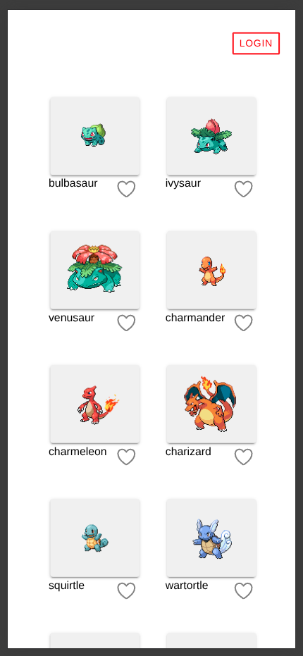

# Desafio BSN - Vaga para Dev FullStack Junior

Aplicação feita utilizando Ionic + Angular 19 e supabase para a criação do banco de dados e autenticação via email.

O Banco de Dados Postgres disponível via Supabase, é responsável por guardar os dados de pokemons favoritados pelo usuário.

O app, foi pensado para ser simples, mas responsivo e intuitivo.

A paginação acontece tanto para durante as requisições para PokeAPI como para o banco de dados Postgres.

A Autenticação via Magic link, facilita o gerenciamento de usuários. Dessa forma, não precisamos de página de recuperação de senhas, nem de nos preocuparmos com o gerenciamento e armazenamento das senhas, apenas um link que é enviado por email com o token para o usuário realizar seu login/signup.

Todas as tarefas foram pensadas e colocada em um quadro seguindo o padrão Kanban: https://github.com/Dpbm/bsn-challenge.

# Como executar

Para executar, é necessário:
1. criar uma conta no [supabase](https://supabase.com/)
2. criar um projeto
3. Configurar o banco de dados. Para isso, há um arquivo `sql` em [./db/](./db/tables.sql) com a estrutura das tabelas, apenas copie estes comandos e cole dentro do SQL Editor na plataforma e execute tudo.
4. adicione suas credenciais em um arquivo `.env` e execute `npm run env:conf`
5. execute no terminal `npm run start` 

# Imagens da aplicação

# Vídeo de demonstração

